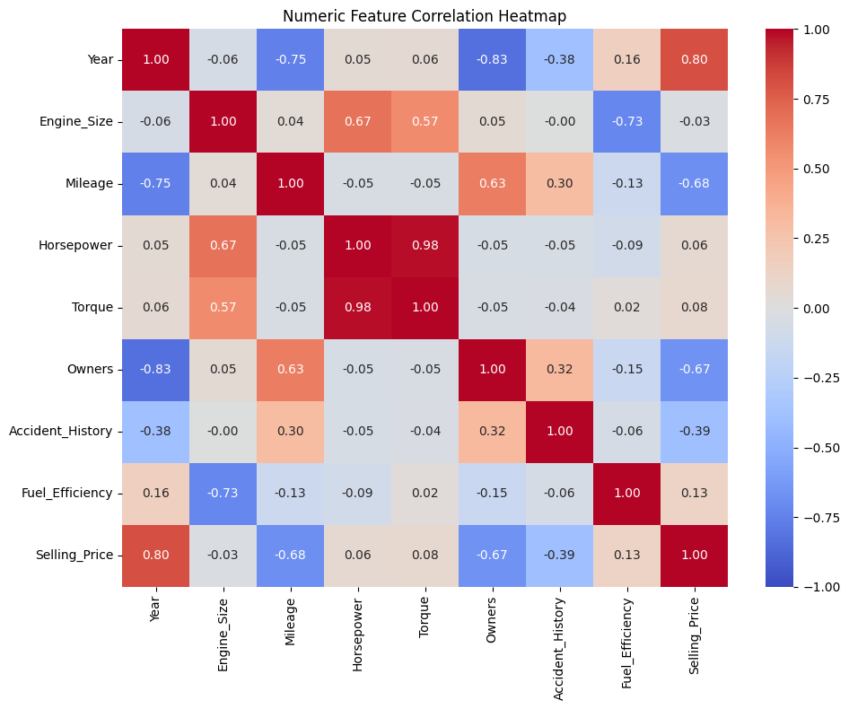
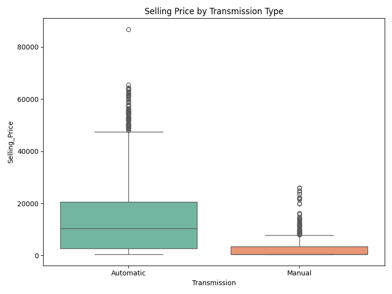
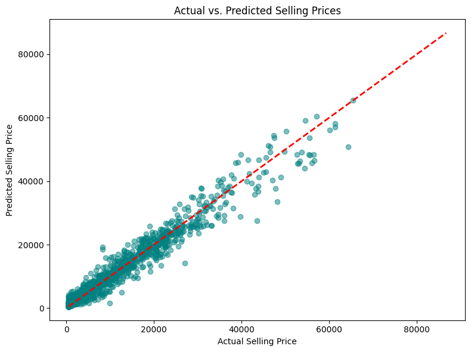
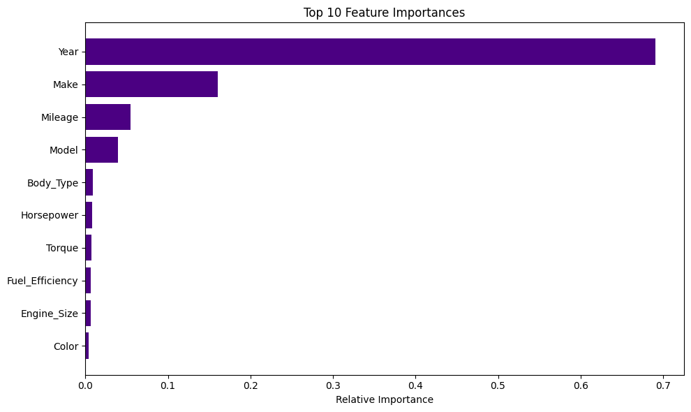

# Automotive Asset Valuation Engine

An end-to-end machine learning regression pipeline that predicts the market value of used automobiles from technical specifications, condition indicators, and historical depreciation patterns — built to replace intuition-based appraisal with a reproducible, leakage-safe modeling workflow.

## Business Objective

In asset-heavy industries, mispricing inventory leads to direct revenue loss or delayed capital liquidation. This project demonstrates a regression pipeline that dynamically estimates the fair market value of used vehicles, using engine, transmission, service history, and condition features. The same architecture generalizes to other depreciating-asset problems: industrial machinery pricing, fleet valuation, or equipment resale forecasting.

## Methodology & Analytical Approach

**Feature engineering**
- Missingness in `Transmission` is captured explicitly as a binary indicator (`Transmission_missing`) rather than silently imputed away, preserving any signal in *why* a value is missing.

**Column-aware preprocessing**
Rather than applying one blanket imputation strategy, columns are segmented by how their missingness should be handled:
- **Mode imputation** — categorical fields (`Make`, `Model`, `Fuel_Type`, `Transmission`, `Service_History`, `Color`, `Body_Type`, `Drivetrain`, `Location`) and weak-signal numeric fields (`Accident_History`) are filled with the most frequent value.
- **Ordinal encoding** — all categorical fields are converted to numeric codes via `OrdinalEncoder`, with unseen categories safely mapped to a sentinel value rather than raising an error.
- **Iterative (regression-based) imputation** — correlated numeric fields (`Engine_Size`, `Horsepower`, `Torque`, `Fuel_Efficiency`) are imputed using `IterativeImputer` with a `BayesianRidge` estimator, letting each feature be predicted from the others rather than filled with a static statistic.
- **Standardization** — all features are scaled with `StandardScaler` to prevent any single feature from dominating due to scale.

**Modeling**
- A `RandomForestRegressor` is wrapped in a `TransformedTargetRegressor`, applying a `log1p` transform to the target (`Selling_Price`) before training and an `expm1` inverse transform on predictions — stabilizing variance across the wide price range typical of used-vehicle data.
- The entire preprocessing + modeling stack is composed into a single scikit-learn `Pipeline`, ensuring every imputation and encoding step is fit only on training folds during cross-validation, preventing data leakage.

**Evaluation**
- 5-fold `KFold` cross-validation (shuffled, fixed random state) reports MAE, RMSE, and R² for a stable, non-overfit estimate of real-world performance.

## Results

| Metric | Score |
|---|---|
| **Average MAE** | $1,933.45 |
| **Average RMSE** | $3,239.98 |
| **Average R²** | 0.9341 |

The model explains ~93% of the variance in selling price, with an average prediction error of under $2,000 — a strong result for a used-vehicle pricing task with meaningful category diversity (make, model, drivetrain, etc.).

## Visualizations

**Correlation Heatmap** — surfaces which numeric specs move together, motivating the choice of regression-based imputation for the correlated engine/performance features.



**Selling Price by Transmission (Boxplot)** — compares price distributions across transmission types.



**Actual vs. Predicted Scatter Plot** — visualizes prediction accuracy against a perfect-prediction reference line.



**Top 10 Feature Importances** — ranks which specs the Random Forest relies on most heavily when pricing a vehicle.



## Key Business Insights

1. **Automated Valuation** — tree-based regression captures non-linear depreciation effects (e.g., steep first-year value drops) that a simple linear model would miss, replacing manual, intuition-based appraisal with a repeatable, data-backed estimate.
2. **Imputation as a Modeling Decision** — treating missingness itself as a feature (`Transmission_missing`) and choosing imputation strategy per-column (mode vs. regression-based) rather than one-size-fits-all meaningfully improves data quality going into the model.
3. **Leakage-Safe Design** — wrapping every preprocessing step inside the cross-validated pipeline ensures the reported R² of 0.93 reflects genuine generalization, not information leaking from the imputation or encoding steps.

## Repository Structure

```text
├── data/                   # Raw and processed automotive datasets
├── notebooks/              # Jupyter notebooks 
├── reports/                # Visualizations and Business Analytics Report
├── requirements.txt        # Python dependencies
└── README.md
```

## Setup & Usage

```bash
# Clone the repository
git clone https://github.com/<your-username>/automotive-asset-valuation.git
cd automotive-asset-valuation

# Install dependencies
pip install -r requirements.txt

# Run the notebooks in order
jupyter notebook notebooks/automobile_price_prediction_model.ipnyb
```

## Tech Stack

`Python` · `pandas` · `NumPy` · `scikit-learn` · `seaborn` · `matplotlib`
